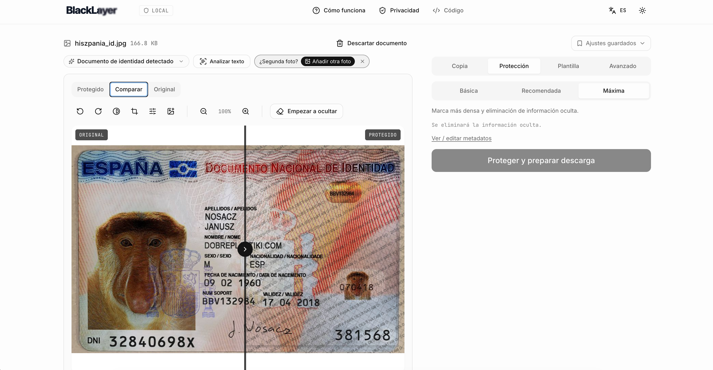

<p align="center">
  <picture>
    <source media="(prefers-color-scheme: dark)" srcset="public/logo-wordmark-dark.svg">
    
  </picture>
</p>

<p align="center"><strong>Local-first document protection for safer sharing.</strong></p>

<p align="center">
  
</p>

<p align="center"><em>Drop a document, name the recipient and the purpose, and BlackLayer bakes a repeated watermark into the pixels together with an optional security pattern. Metadata is stripped in the same pass. Everything runs in your browser — nothing is uploaded.</em></p>

<p align="center">
  <a href="https://www.youtube.com/watch?v=TnKzfRlxc3s">
    
  </a>
</p>

<p align="center"><em>Two-minute walkthrough on YouTube: dropping a document, filling recipient and purpose, redacting extra areas, and downloading the protected copy.</em></p>

# BlackLayer

**English.** Local-first document protection for safer sharing. Add purpose-bound watermarks, redact sensitive areas, remove hidden metadata, and export protected PDFs or images entirely on your device. No uploads, no accounts, no cloud.

**Español.** Protección de documentos local para compartirlos con más seguridad. Añade marcas de agua con destinatario y motivo, tapa zonas sensibles, elimina la información oculta y exporta PDFs o imágenes protegidos sin salir de tu dispositivo. Sin subidas, sin cuentas, sin nube.

## Screenshots

The image above shows the compare view. See [`demo/`](demo/README.md) for four more annotated screenshots: the protected result on its own, the copy tab with zoom, the advanced controls, and manual pixelate redaction — all on the same sample Spanish DNI.

## Who this is for / Casos de uso

Everyday people who need to hand a copy of an identity document, a payslip, a rental agreement or a bank statement to a third party and want to reduce what that third party can do with it afterwards.

Gente normal que tiene que entregar copia de un DNI, una nómina, un contrato de alquiler o un extracto bancario a un tercero y quiere reducir lo que ese tercero puede hacer con esa copia después.

Real, concrete scenarios / Ejemplos reales:

- **Reserving a hotel or a short-term rental.** The Spanish data-protection authority is explicit that a hotel is not entitled to demand a copy of your DNI or passport as a general rule ([AEPD note](https://www.aepd.es/prensa-y-comunicacion/notas-de-prensa/aepd-informa-de-que-no-esta-permitido-solicitar-copia-dni-o-pasaporte-en-hospedajes)). If you decide to hand one over anyway (or you are in a jurisdiction that permits it), the copy that leaves your hands should carry a visible reason and a recipient.
- **Applying for a rental property.** Rental scams involving photocopies of ID and payslips are common. Both the Catalan cybersecurity agency ([guide on rental scams](https://ciberseguretat.gencat.cat/es/ciutadania/frau-i-suplantacio/estafes-lloguer-dhabitatges)) and mainstream press ([El País — "ojo al último fraude del ladrillo"](https://elpais.com/economia/negocios/2022-09-17/ojo-al-ultimo-fraude-del-ladrillo-llegan-los-pisos-de-alquiler-bonitos-y-baratos-que-no-existen.html)) have flagged the pattern. A watermarked copy bound to that specific agency and purpose is much harder to redeploy against you.
- **Lawyers and advisors handling client documents.** When you have to forward a client-provided document to a counterparty or an administrative body, the copy that leaves your desk should carry the case reference and the recipient.
- **Employees sharing a payslip or contract with a landlord, a bank, or an insurer.** A payslip carries salary, bank details, employer and address. A watermark bound to the specific recipient makes casual reuse traceable.
- **Anyone who has ever felt uncomfortable sending a photo of their DNI over WhatsApp or email.** ([Short walk-through of why that is a real risk](https://www.youtube.com/watch?v=EuzYjT5Twew).)

BlackLayer does not stop determined fraud on its own; nothing visual can. It raises the cost, and it removes the "silent, reusable, clean copy" from the equation.

## Why this exists

I regularly need to send copies of my ID, passport, payslip, or a contract to a hotel, landlord, bank, or employer. Once the copy is out of my hands I have no control over how long it lives on someone else's server or what it gets reused for. There are good open-source tools for pieces of this problem, but I wanted one local tool that puts the whole workflow together on my own machine, in a shape I can maintain and trust.

## Credits and inspiration

BlackLayer is a fresh implementation, not a fork. It builds on ideas explored by these open-source projects; each is worth a look on its own:

- [PDF-Protect](https://github.com/ToritoIO/PDF-Protect) — client-side PDF watermarking with a clean, focused UI.
- [SafeID / datosargentinos.com](https://github.com/Xyborg/datosargentinos.com) — local Argentine DNI redaction, three-step workflow, sensible service-worker posture.
- [Firemark](https://github.com/Vitruves/firemark) — a rich native watermark engine with security patterns.
- [SaferLayer](https://saferlayer.com) — the general idea of "layered, contextual document protection" as a category.

None of the code in this repository is copied from those projects. Where a technique or UX pattern was directly informed by one of them, it's noted in the source. This is not an attempt to reproduce any of them; it's my own local-first take on the same problem.

## How this is built

BlackLayer is developed with the help of AI models. I use them as a fast, unopinionated pair for the surface-level scaffolding — file layout, boilerplate, string plumbing, config wiring — so I can spend my own attention on the ideas that actually matter for a privacy tool: what the workflow should feel like, what threat model to defend against, what claims we can honestly make, and what to explicitly refuse to promise. Every design decision, every threat-model call, every "no, we won't ship that" is a human one. AI helps me get to a working iteration faster; it does not decide what BlackLayer is.

## What BlackLayer actually does

- Adds a repeated, purpose-bound watermark ("COPY FOR X · FOR Y ONLY · date") over the document.
- Uses a per-document cryptographic random seed to vary watermark position, rotation, size, and opacity across tiles. Two exported copies of the same document look subtly different, so tools that expect a regular grid have less to lock onto.
- Optionally adds a crosshatch security pattern and a border frame at higher protection levels.
- Rasterizes any PDF page that has manual redactions. Redacted regions are destroyed at the pixel level rather than covered by an overlay that could be lifted. Redactions can be solid, blur, or pixelate (solid is safest).
- Neutralizes PDF metadata (author, subject, keywords, creation and modification dates), drops the XMP metadata stream so edit history, application traces, and stable document IDs do not survive, and strips image metadata by canvas re-encode.
- Detects a digital signature in the source PDF and warns before creating a copy that would invalidate it.
- Auto-detects common document types (DNI, passport, contract, payslip, invoice, financial) from filename, PDF text, and page dimensions, then recommends a protection level and suggests context-appropriate purposes.
- Saves the recipient + purpose + level combos you use often as local presets. Nothing leaves the browser. A "Delete all local settings" action wipes them along with your theme and language preferences.
- Batch mode: drop multiple files at once, apply one recipient + purpose + level + patterns to all, download individually or as a single zip. Manual redaction is per-document and stays out of the batch flow.

## What BlackLayer explicitly does not promise

- **It is not "unremovable".** A determined attacker with modern AI-driven inpainting, careful manual editing, or unlimited time can remove or reconstruct protected content. BlackLayer raises the cost; it does not make the cost infinite.
- **It cannot stop recapture.** Screenshots, photos of the screen, or a camera pointed at a printed copy will always work.
- **It cannot control what the recipient does.** Once you hand a copy to someone, its downstream use is out of scope.
- **It is an open-source tool provided as-is.** See the [MIT LICENSE](LICENSE). If you deploy or redistribute a build, that build is your responsibility.

## Quick start (development)

```
npm ci
npm run dev
```

Then open the URL Vite prints. Drop a PDF or image, fill in recipient and purpose, download the protected copy.

## Docker

A `Dockerfile` and a `compose.yaml` are included. The image is a multi-stage build: `node:20-alpine` builds the static assets, then `nginx:1.27-alpine` serves them as a non-root user on port 8080. The runtime container is read-only with dropped capabilities.

```
docker compose up -d --build
```

Then open http://localhost:8080.

To stop and remove:

```
docker compose down
```

The nginx config in [nginx.conf](nginx.conf) enforces the same Content-Security-Policy as the app's `<meta>` tag, sets `X-Content-Type-Options`, `X-Frame-Options`, `Referrer-Policy`, and a `Permissions-Policy` that disables camera, microphone, geolocation, and interest-cohort. If you host BlackLayer behind a proxy that rewrites headers, verify the CSP still reaches the browser.

## Roadmap

Rough shape of what is planned. Nothing here is a commitment; priorities move as the tool gets used against real documents.

**Near term**

- Local OCR for image documents so photos of IDs, passports, and driving licences get the same content-based detection PDFs already do. First pass will target Spanish and English via a bundled, offline engine.
- First-run onboarding for people who land on the app cold.
- More security patterns beyond the current crosshatch and frame: guilloche, rosette, moiré, mesh, and a distinctly decorative iridescent (holographic-style) overlay. Explicitly not on the table: simulating real, official government hologram foils. The line is watermark vs. counterfeit. Everything in this list is decorative and clearly reads as user-added, never as a claim of authenticity.

**Later research**

- Broader-language, higher-accuracy local OCR and vision models running entirely on the user's hardware to preserve document privacy. Candidates I want to evaluate:
  - PaddleOCR by Baidu, an open-source OCR that handles Chinese text well.
  - Lightweight document parsers along the lines of Unlimited-OCR / Qianfan-OCR (baidu/Qianfan-OCR).
  - Vision-language models such as Qwen2-VL for local extraction and layout understanding.

  Anything integrated here must run fully offline and never send document contents to a third-party service. The goal is stronger detection and, eventually, safer field-level auto-hiding without weakening the local-first guarantee.

- Tauri desktop packaging so the app installs as a native application on Windows, Linux, and macOS.

**Not on the roadmap**

- Server-side processing.
- Any feature that requires a user account.
- Any feature that transmits document contents to a third party.

## License and attributions

MIT. See [LICENSE](LICENSE).

Third-party runtime libraries and bundled fonts are attributed in [THIRD_PARTY_NOTICES.md](THIRD_PARTY_NOTICES.md).
