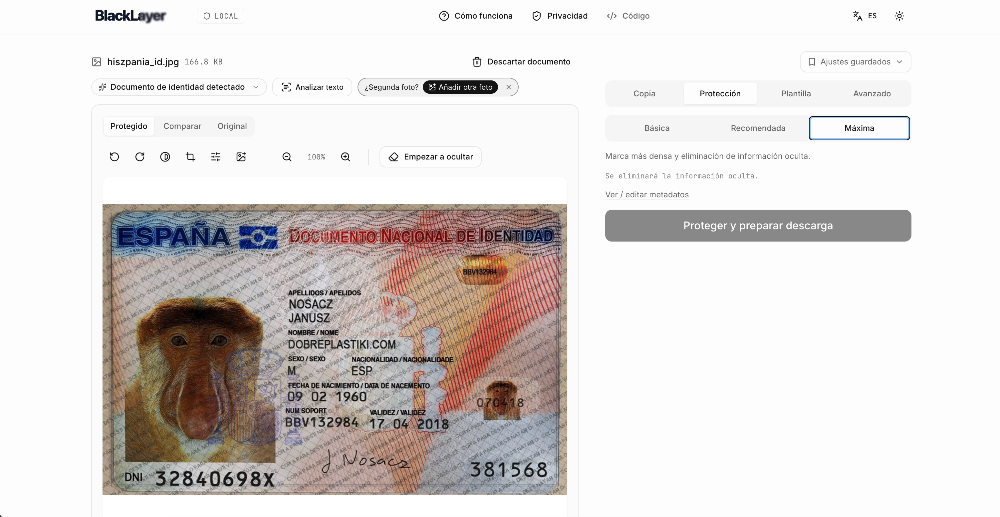
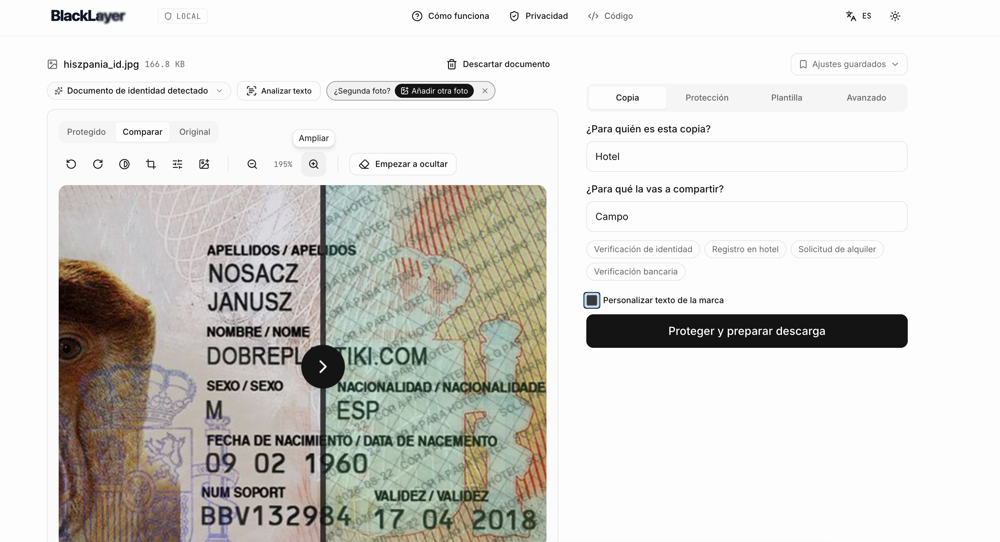
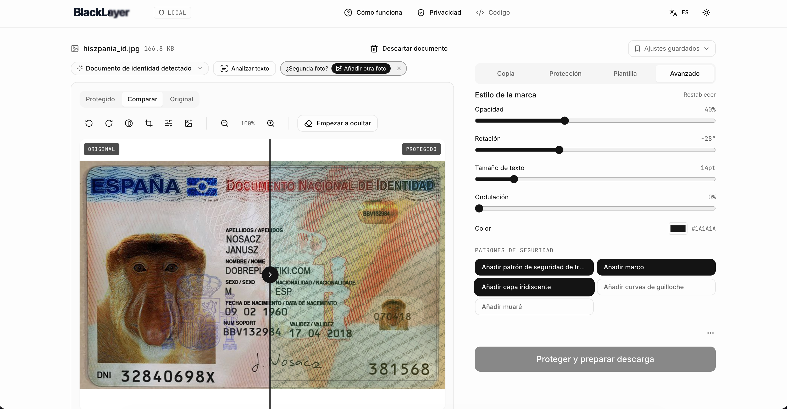
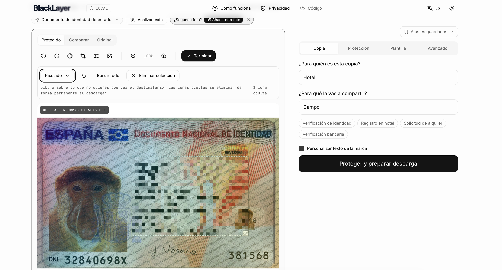

# Demo

Screenshots of BlackLayer running locally on a sample Spanish DNI. Every step happens in the browser; nothing is uploaded.

## 1. Compare original and maximum protection

The **Compare** tab lets you slide between the original document and the protected copy. Here the protection level is set to **Maximum**: a dense, repeating watermark ("COPIA PARA HOTEL · SOLO PARA CAMPO · date") is baked into the pixels together with a crosshatch security pattern, and every piece of embedded metadata is stripped from the output.

## 2. The protected result

Switching to the **Protected** view shows what the recipient will actually see. The watermark and security pattern are rasterized into the image, so the sensitive content is destroyed at the pixel level rather than covered by a removable overlay.

## 3. Recipient, purpose and zoom

The **Copy** tab is where you say who the copy is for and why. Suggestions ("Identity verification", "Hotel check-in", "Rental application", "Bank verification") are context-aware based on the detected document type. The preview supports zoom (Cmd/Ctrl +/-/0) so you can inspect how the watermark falls over any specific region — here at 195%.

## 4. Advanced controls

The **Advanced** tab lets you fine-tune the watermark style — opacity, rotation, text size, waviness, color — and toggle security patterns (crosshatch, frame, iridescent, guilloche, moiré) individually. Defaults come from the chosen protection level; overrides apply live in the preview.

## 5. Manual pixelate redaction

**Redact** mode lets you draw over anything the automatic template does not cover. Three styles are available: solid, blur, and pixelate. Here a single region covers the DNI number, birth date and identification block with a pixelate destruction. The redacted area is destroyed in the output image, not simply covered by an overlay that could be peeled off.

---

The sample document is a public specimen ID from `dobreplastiki.com`, used here only to demonstrate the interface.
